::: {.callout-note appearance="minimal" style="border-left-color: #b01c2e;"}
PhD researchers who joined the Practice-Oriented AI CDT in the 2024 cohort.
:::

::: {.grid}

<!-- Abby Morris -->
::: {.g-col-12 .g-col-md-6 .g-col-lg-4}
::: {.student-card}

  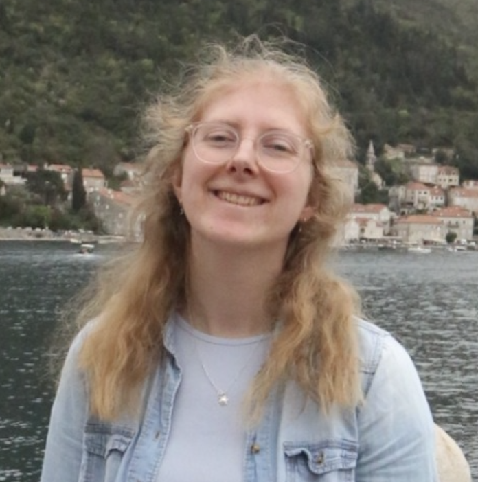
  <h4 class="fw-bold m-0 fs-5" style="color: #1e293b;">Abby Morris</h4>

Abby is a data scientist with four years professional experience after graduating with a master’s degree in physics. Her current research interests are centred around improving upon physical models with physics-informed machine learning or other deep learning AI algorithms.

::: {.student-supervisor .mt-3}
**Supervisor:** *TBC*  
:::
Personal page coming soon
:::
:::

<!-- Ed Daniels -->
::: {.g-col-12 .g-col-md-6 .g-col-lg-4}
::: {.student-card}

  
  <h4 class="fw-bold m-0 fs-5" style="color: #1e293b;">Ed Daniels</h4>

Ed previously completed a first-class Master’s degree in Film and Television within Innovation. His research interests span organoids, robotics, LLMs, and alignment, but as a general rule, he attracted to interesting problems and technology.

::: {.student-supervisor .mt-3}
**Supervisor:** *TBC*  
:::
Personal page coming soon
:::
:::

<!-- Gonzalo Cancio -->
::: {.g-col-12 .g-col-md-6 .g-col-lg-4}
::: {.student-card}

  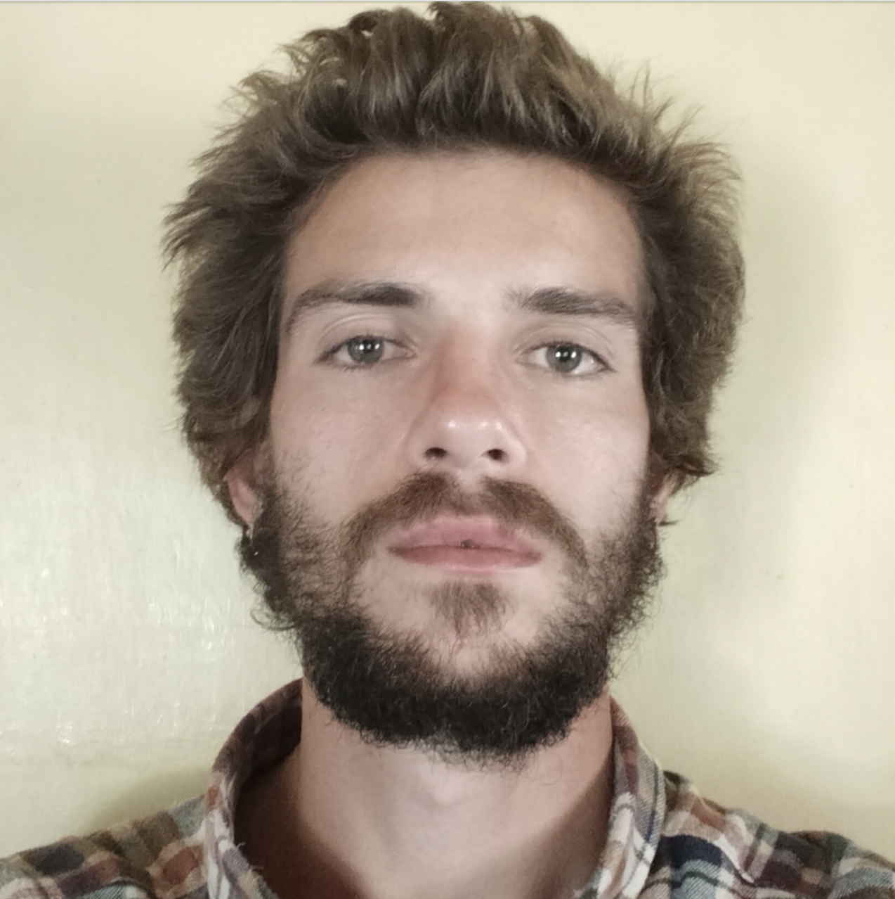
  <h4 class="fw-bold m-0 fs-5" style="color: #1e293b;">Gonzalo Cancio</h4>

Gonzalo is a maths graduate from the University of Glasgow. His interests include model compression techniques and use of tensor networks to explore new DL architectures, as well as connections between AI cryptography, cybersecurity and autonomous cyber defence.

::: {.student-supervisor .mt-3}
**Supervisor:** *TBC*  
:::
Personal page coming soon
:::
:::

<!-- Guoda Laurinaviciute -->
::: {.g-col-12 .g-col-md-6 .g-col-lg-4}
::: {.student-card}

  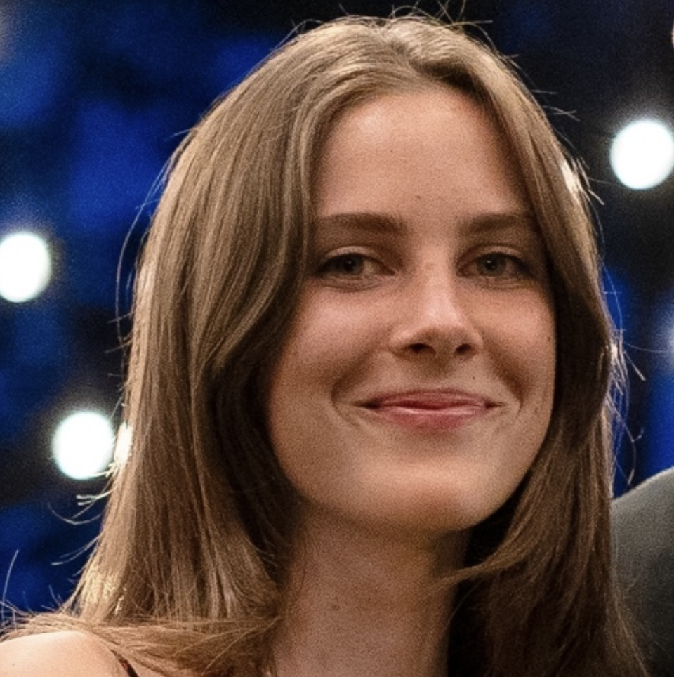
  <h4 class="fw-bold m-0 fs-5" style="color: #1e293b;">Guoda Laurinaviciute</h4>

Guoda completed a Bachelor's degree in Artificial Intelligence at the University of Manchester before pursuing a Master’s by Research at the University of Bristol. Her research interests include UAVs, defence applications, and computer vision.

::: {.student-supervisor .mt-3}
**Supervisor:** *TBC*  
:::
Personal page coming soon
:::
:::

<!-- Ikechukwu Ofodile -->
::: {.g-col-12 .g-col-md-6 .g-col-lg-4}
::: {.student-card}

  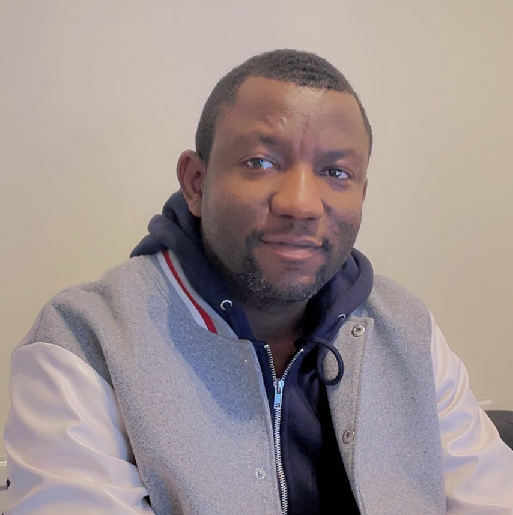
  <h4 class="fw-bold m-0 fs-5" style="color: #1e293b;">Ikechukwu Ofodile</h4>

Ike holds degrees in Electrical & Electronics Engineering and Robotics & Computer Engineering. His research interests include AI-enabled perception systems, with multi-modal sensor fusion, computer vision, and predictive maintenance.

::: {.student-supervisor .mt-3}
**Supervisor:** *TBC*  
:::
Personal page coming soon
:::
:::

<!-- Isobel Higgins -->
::: {.g-col-12 .g-col-md-6 .g-col-lg-4}
::: {.student-card}

  
  <h4 class="fw-bold m-0 fs-5" style="color: #1e293b;">Isobel Higgins</h4>

Isobel completed a BSc in Physics with Scientific Computing at the University of Bristol. Her research interests centre on the application of AI in healthcare, especially women’s reproductive and cognitive health.

::: {.student-supervisor .mt-3}
**Supervisor:** *TBC*  
:::
Personal page coming soon
:::
:::

<!-- Noah Baker -->
::: {.g-col-12 .g-col-md-6 .g-col-lg-4}
::: {.student-card}

  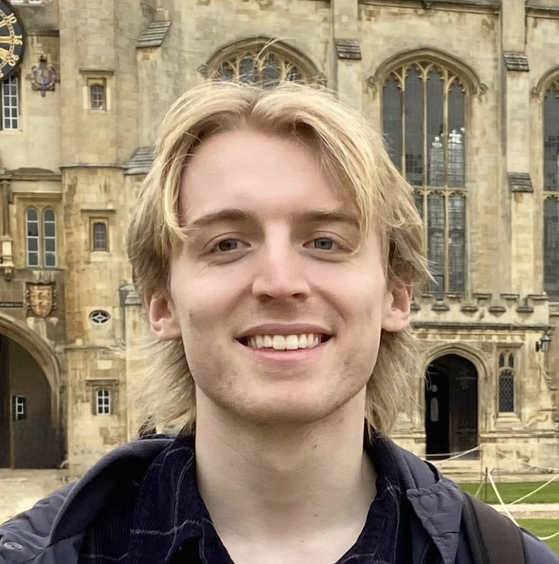
  <h4 class="fw-bold m-0 fs-5" style="color: #1e293b;">Noah Baker</h4>

Noah graduated from the University of Cambridge with an MEng in Information and Computer Engineering. He is interested in neuro-symbolic AI, NLP, and generally methods of increasing the interpretability of state-of-the-art AI models.

::: {.student-supervisor .mt-3}
**Supervisor:** *TBC*  
:::
Personal page coming soon
:::
:::

<!-- Nyamvula Chakaya -->
::: {.g-col-12 .g-col-md-6 .g-col-lg-4}
::: {.student-card}

  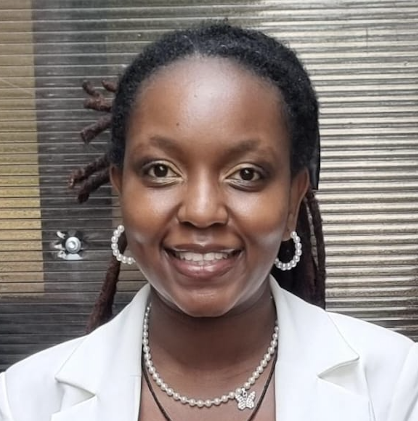
  <h4 class="fw-bold m-0 fs-5" style="color: #1e293b;">Nyamvula Chakaya</h4>

Chakaya holds a BSc in Computer Science and an MSc in AI and Data Science. Her interests include natural language processing, large language models, generative AI, AI in healthcare and ethical AI, in particular within real world decision making.

::: {.student-supervisor .mt-3}
**Supervisor:** *TBC*  
:::
Personal page coming soon
:::
:::

<!-- Priya Kharbanda -->
::: {.g-col-12 .g-col-md-6 .g-col-lg-4}
::: {.student-card}

  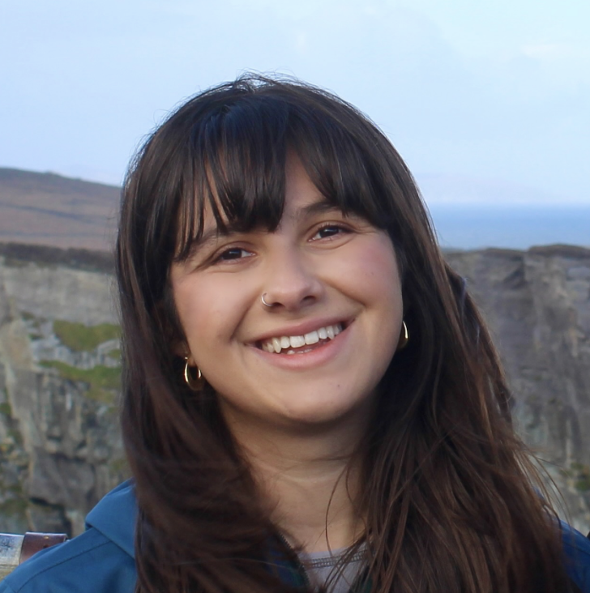
  <h4 class="fw-bold m-0 fs-5" style="color: #1e293b;">Priya Kharbanda</h4>

Priya graduated with a Master’s in Electrical and Electronic Engineering. She is especially interested in how AI systems earn trust in practice and how thoughtful design can support their safe, reliable use within healthcare.

::: {.student-supervisor .mt-3}
**Supervisor:** *TBC*  
:::
Personal page coming soon
:::
:::

<!-- Russell Summers -->
::: {.g-col-12 .g-col-md-6 .g-col-lg-4}
::: {.student-card}

  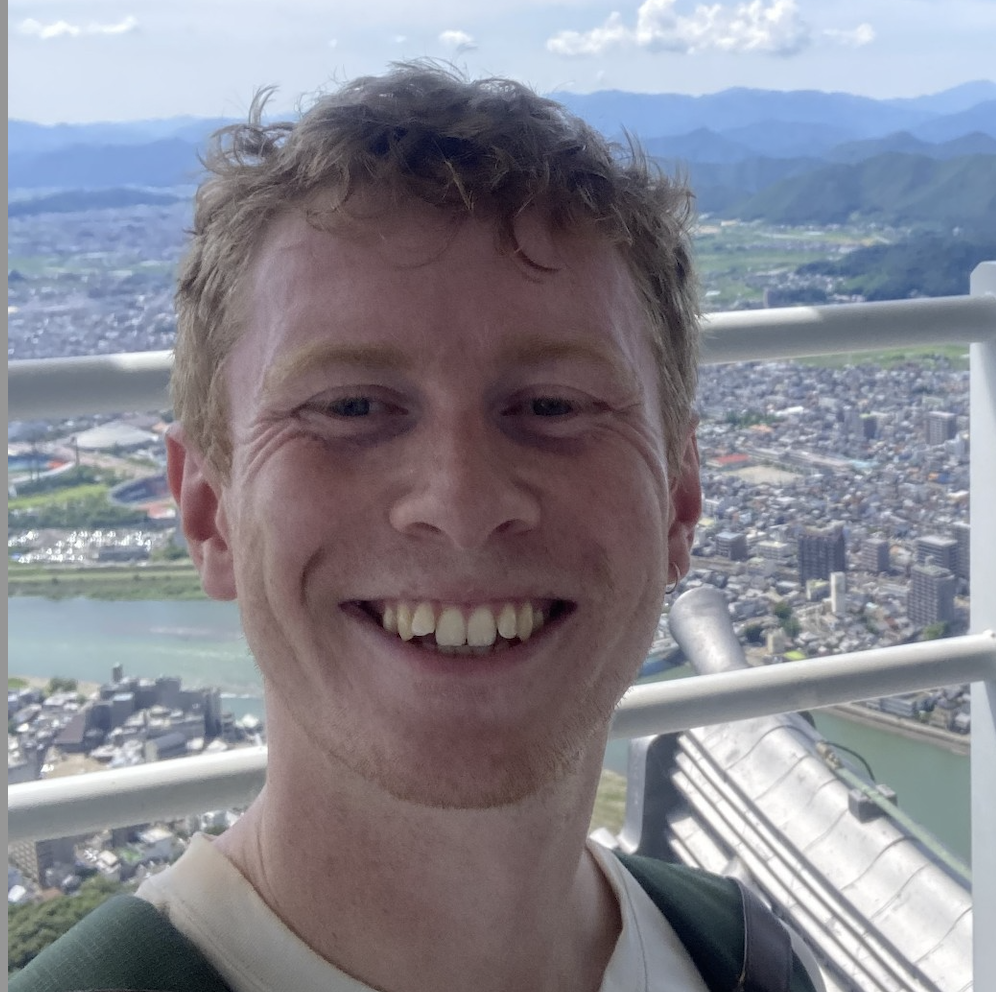
  <h4 class="fw-bold m-0 fs-5" style="color: #1e293b;">Russell Summers</h4>

Russell has a background in Biomedical Science and holds an MSc in Health Data Science and Statistics. During his MSc, he developed machine learning models to predict Alzheimer’s disease from blood metabolite data.

::: {.student-supervisor .mt-3}
**Supervisor:** *TBC*  
:::
Personal page coming soon
:::
:::

<!-- Sanjukta Bhattacharya -->
::: {.g-col-12 .g-col-md-6 .g-col-lg-4}
::: {.student-card}

  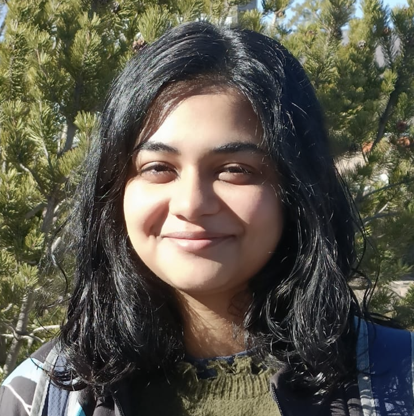
  <h4 class="fw-bold m-0 fs-5" style="color: #1e293b;">Sanjukta Bhattacharya</h4>

Sanjukta completed her Master's by Research in ML at the University of Edinburgh. She is interested in reinforcement learning as a method to improve foundation model outputs, along with similar post-training paradigms.

::: {.student-supervisor .mt-3}
**Supervisor:** *TBC*  
:::
Personal page coming soon
:::
:::

<!-- Sophie Maw -->
::: {.g-col-12 .g-col-md-6 .g-col-lg-4}
::: {.student-card}

  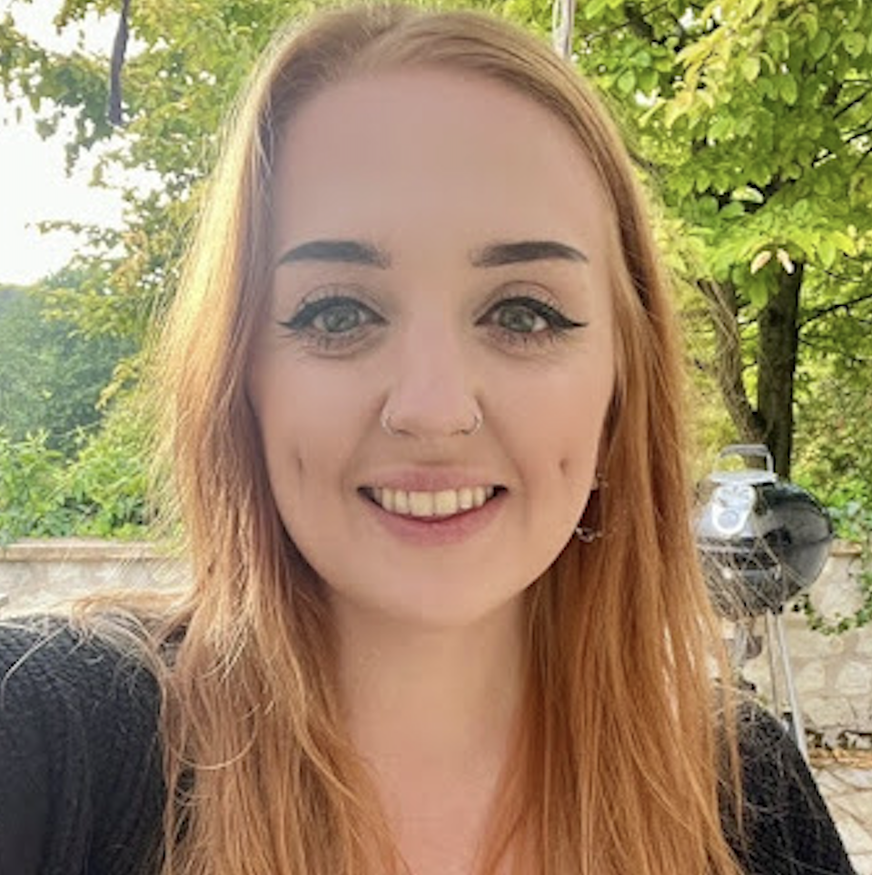
  <h4 class="fw-bold m-0 fs-5" style="color: #1e293b;">Sophie Maw</h4>

Sophie completed an MEng in Electronic Engineering and worked as an AI Researcher for a start-up. Her background includes computer vision, photogrammetry, visual perception, vision systems, and human-level reasoning.

::: {.student-supervisor .mt-3}
**Supervisor:** *TBC*  
:::
Personal page coming soon
:::
:::

<!-- Tom Heslin -->
::: {.g-col-12 .g-col-md-6 .g-col-lg-4}
::: {.student-card}

  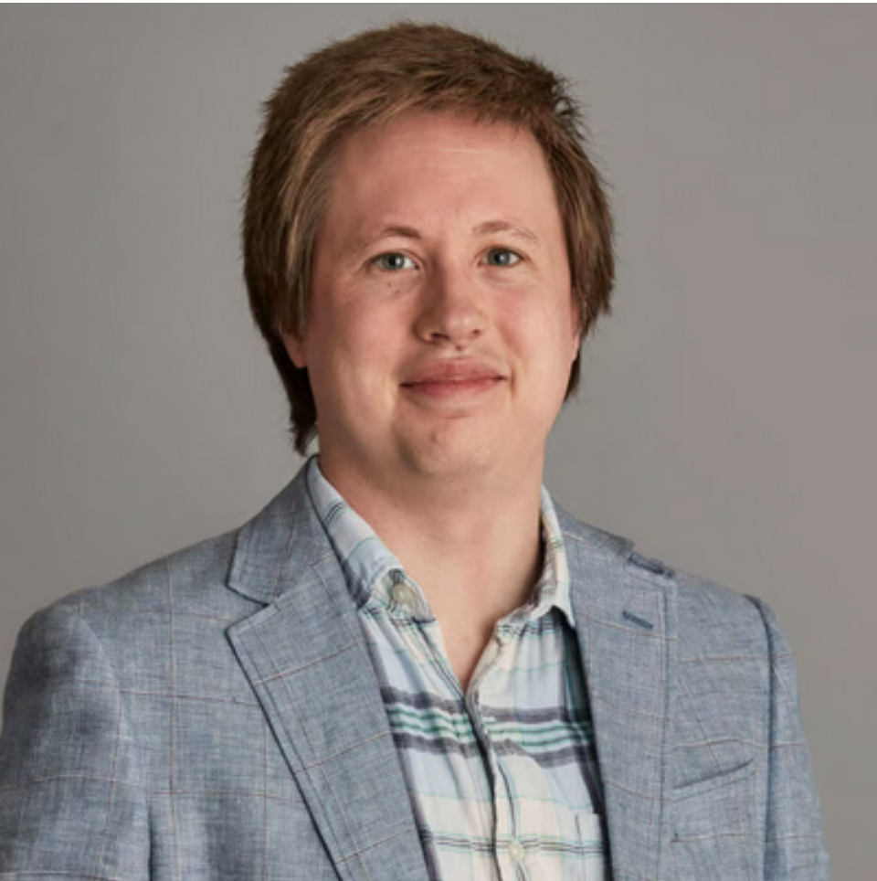
  <h4 class="fw-bold m-0 fs-5" style="color: #1e293b;">Tom Heslin</h4>

Tom graduated with an MSc in Medical Image Computing from UCL. His research interests focus on AI safety and explainability, with a specific interest in mechanistic interpretability within video and autonomous vehicle models.

::: {.student-supervisor .mt-3}
**Supervisor:** *TBC*  
:::
Personal page coming soon
:::
:::

:::