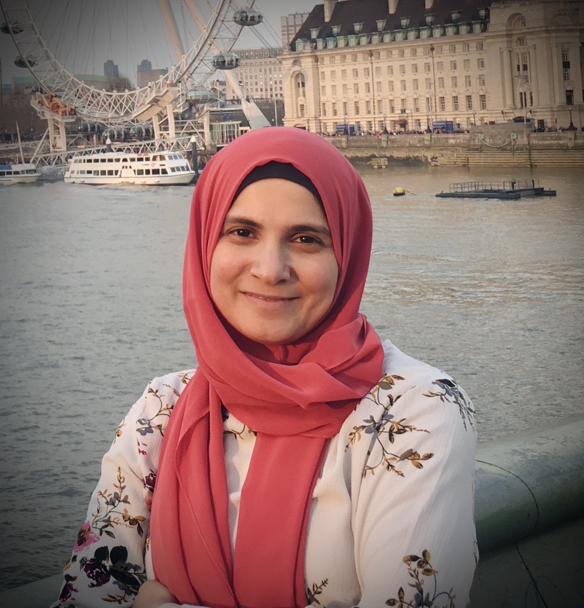
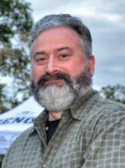
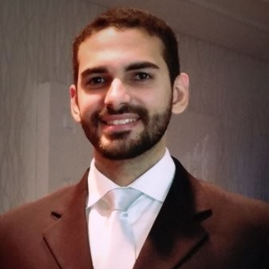
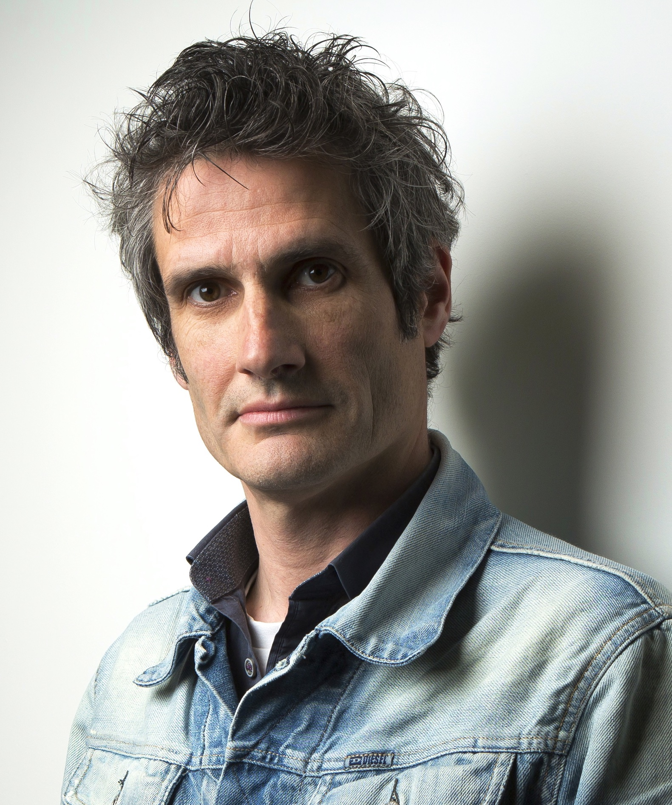
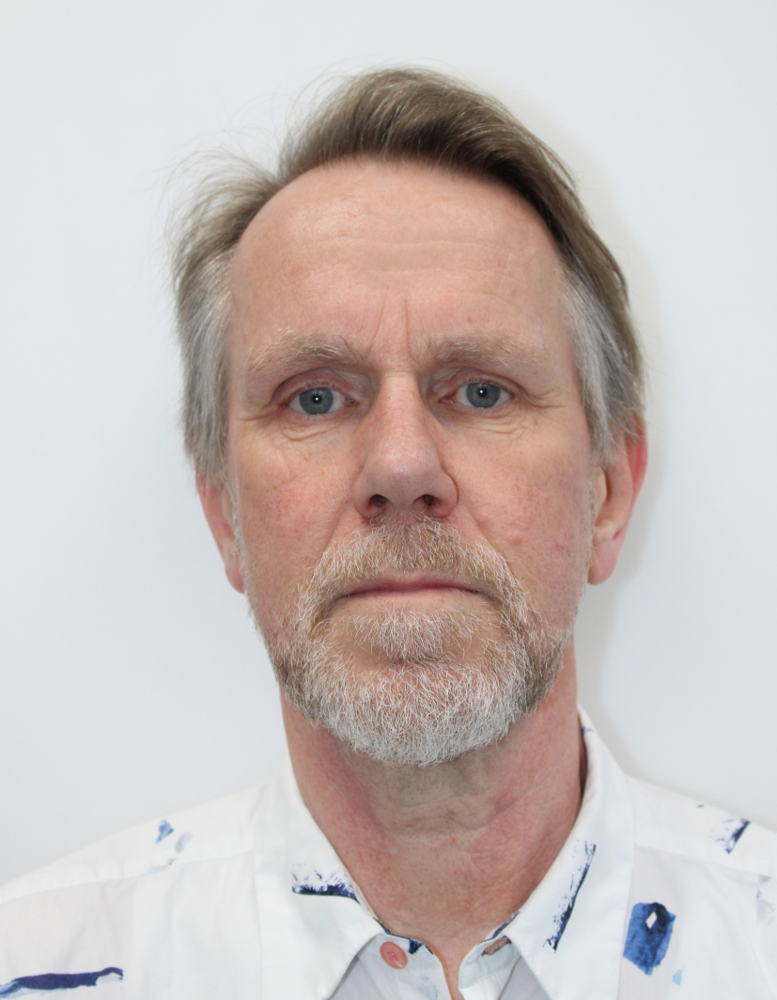
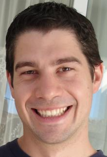

::: {.callout-note appearance="minimal" style="border-left-color: #b01c2e;"}
Our CDT features a diverse pool of world-class supervisors from across the University of Bristol, guiding research in foundational and applied practical AI.
:::

<!-- Estilos customizados para os Cards de Supervisores -->

::: {.grid}

<!-- Dr Zahraa Abdallah -->
::: {.g-col-12 .g-col-sm-6 .g-col-md-4 .g-col-lg-3}
::: {.supervisor-card}
<path d=\'M12 12c2.21 0 4-1.79 4-4s-1.79-4-4-4-4 1.79-4 4 1.79 4 4 4zm0 2c-2.67 0-8 1.34-8 4v2h16v-2c0-2.66-5.33-4-8-4z\'/></svg>'">
<h5 class="fw-bold m-0" style="color: #1e293b; font-size: 1.05rem;">Dr Zahraa Abdallah</h5>
[University Profile →](https://www.bristol.ac.uk/people/person/Zahraa-Abdallah-06844ace-4e4b-4cf5-8212-7266bec7ede8/){.supervisor-link target="_blank"}
:::
:::

<!-- Professor Andrew Charlesworth -->
::: {.g-col-12 .g-col-sm-6 .g-col-md-4 .g-col-lg-3}
::: {.supervisor-card}
<path d=\'M12 12c2.21 0 4-1.79 4-4s-1.79-4-4-4-4 1.79-4 4 1.79 4 4 4zm0 2c-2.67 0-8 1.34-8 4v2h16v-2c0-2.66-5.33-4-8-4z\'/></svg>'">
<h5 class="fw-bold m-0" style="color: #1e293b; font-size: 1.05rem;">Prof. Andrew Charlesworth</h5>
[University Profile →](https://www.bristol.ac.uk/people/person/Andrew-Charlesworth-713e018c-750d-4cfa-a273-429c0570d9aa/){.supervisor-link target="_blank"}
:::
:::

<!-- Dr Telmo de Menezes e Silva Filho -->
::: {.g-col-12 .g-col-sm-6 .g-col-md-4 .g-col-lg-3}
::: {.supervisor-card}
<path d=\'M12 12c2.21 0 4-1.79 4-4s-1.79-4-4-4-4 1.79-4 4 1.79 4 4 4zm0 2c-2.67 0-8 1.34-8 4v2h16v-2c0-2.66-5.33-4-8-4z\'/></svg>'">
<h5 class="fw-bold m-0" style="color: #1e293b; font-size: 1.05rem;">Dr Telmo de Menezes e Silva Filho</h5>
[University Profile →](https://www.bristol.ac.uk/people/person/Telmo-de%20Menezes%20e%20Silva%20Filho-fc698b45-b1f5-45c7-9a07-235f2a876c0c/){.supervisor-link target="_blank"}
:::
:::

<!-- Dr Conor Houghton -->
::: {.g-col-12 .g-col-sm-6 .g-col-md-4 .g-col-lg-3}
::: {.supervisor-card}
<path d=\'M12 12c2.21 0 4-1.79 4-4s-1.79-4-4-4-4 1.79-4 4 1.79 4 4 4zm0 2c-2.67 0-8 1.34-8 4v2h16v-2c0-2.66-5.33-4-8-4z\'/></svg>'">
<h5 class="fw-bold m-0" style="color: #1e293b; font-size: 1.05rem;">Dr Conor Houghton</h5>
[University Profile →](https://www.bristol.ac.uk/people/person/Conor-Houghton-f45783f6-1b75-4e65-98eb-d349cc34cac5/){.supervisor-link target="_blank"}
:::
:::

<!-- Professor Kenton O'Hara -->
::: {.g-col-12 .g-col-sm-6 .g-col-md-4 .g-col-lg-3}
::: {.supervisor-card}
<path d=\'M12 12c2.21 0 4-1.79 4-4s-1.79-4-4-4-4 1.79-4 4 1.79 4 4 4zm0 2c-2.67 0-8 1.34-8 4v2h16v-2c0-2.66-5.33-4-8-4z\'/></svg>'">
<h5 class="fw-bold m-0" style="color: #1e293b; font-size: 1.05rem;">Prof. Kenton O'Hara</h5>
[University Profile →](https://www.bristol.ac.uk/people/person/Kenton-O'Hara-4065c3ec-5b82-45b7-abbf-c43359309e32/){.supervisor-link target="_blank"}
:::
:::

<!-- Professor Raul Santos-Rodriguez -->
::: {.g-col-12 .g-col-sm-6 .g-col-md-4 .g-col-lg-3}
::: {.supervisor-card}
<path d=\'M12 12c2.21 0 4-1.79 4-4s-1.79-4-4-4-4 1.79-4 4 1.79 4 4 4zm0 2c-2.67 0-8 1.34-8 4v2h16v-2c0-2.66-5.33-4-8-4z\'/></svg>'">
<h5 class="fw-bold m-0" style="color: #1e293b; font-size: 1.05rem;">Prof. Raul Santos-Rodriguez</h5>
[University Profile →](https://www.bristol.ac.uk/people/person/Raul-Santos-Rodriguez-1d708791-ea39-4078-89e6-c5c81b8c1a22/){.supervisor-link target="_blank"}
:::
:::

<!-- Dr Nirav Ajmeri -->
::: {.g-col-12 .g-col-sm-6 .g-col-md-4 .g-col-lg-3}
::: {.supervisor-card}
<path d=\'M12 12c2.21 0 4-1.79 4-4s-1.79-4-4-4-4 1.79-4 4 1.79 4 4 4zm0 2c-2.67 0-8 1.34-8 4v2h16v-2c0-2.66-5.33-4-8-4z\'/></svg>'">
<h5 class="fw-bold m-0" style="color: #1e293b; font-size: 1.05rem;">Dr Nirav Ajmeri</h5>
[University Profile →](https://www.bristol.ac.uk/people/person/Nirav-Ajmeri-02e01a96-b140-478a-a451-2eb53cf89dd7/){.supervisor-link target="_blank"}
:::
:::

<!-- Dr James Cussens -->
::: {.g-col-12 .g-col-sm-6 .g-col-md-4 .g-col-lg-3}
::: {.supervisor-card}
<path d=\'M12 12c2.21 0 4-1.79 4-4s-1.79-4-4-4-4 1.79-4 4 1.79 4 4 4zm0 2c-2.67 0-8 1.34-8 4v2h16v-2c0-2.66-5.33-4-8-4z\'/></svg>'">
<h5 class="fw-bold m-0" style="color: #1e293b; font-size: 1.05rem;">Dr James Cussens</h5>
[University Profile →](https://www.bristol.ac.uk/people/person/James-Cussens-97477dd2-9218-47d6-897b-0b0afa580969/){.supervisor-link target="_blank"}
:::
:::

<!-- Professor Peter Flach -->
::: {.g-col-12 .g-col-sm-6 .g-col-md-4 .g-col-lg-3}
::: {.supervisor-card}
<path d=\'M12 12c2.21 0 4-1.79 4-4s-1.79-4-4-4-4 1.79-4 4 1.79 4 4 4zm0 2c-2.67 0-8 1.34-8 4v2h16v-2c0-2.66-5.33-4-8-4z\'/></svg>'">
<h5 class="fw-bold m-0" style="color: #1e293b; font-size: 1.05rem;">Prof. Peter Flach</h5>
[University Profile →](https://www.bristol.ac.uk/people/person/Peter-Flach-a7f5720a-024e-48a2-9cc8-c3d673798c20/){.supervisor-link target="_blank"}
:::
:::

<!-- Dr Paul Marshall -->
::: {.g-col-12 .g-col-sm-6 .g-col-md-4 .g-col-lg-3}
::: {.supervisor-card}
<path d=\'M12 12c2.21 0 4-1.79 4-4s-1.79-4-4-4-4 1.79-4 4 1.79 4 4 4zm0 2c-2.67 0-8 1.34-8 4v2h16v-2c0-2.66-5.33-4-8-4z\'/></svg>'">
<h5 class="fw-bold m-0" style="color: #1e293b; font-size: 1.05rem;">Dr Paul Marshall</h5>
[University Profile →](https://www.bristol.ac.uk/people/person/Paul-Marshall-36d4dfa7-1ec3-4168-9226-130e47809b65/){.supervisor-link target="_blank"}
:::
:::

<!-- Dr Oliver Ray -->
::: {.g-col-12 .g-col-sm-6 .g-col-md-4 .g-col-lg-3}
::: {.supervisor-card}
<path d=\'M12 12c2.21 0 4-1.79 4-4s-1.79-4-4-4-4 1.79-4 4 1.79 4 4 4zm0 2c-2.67 0-8 1.34-8 4v2h16v-2c0-2.66-5.33-4-8-4z\'/></svg>'">
<h5 class="fw-bold m-0" style="color: #1e293b; font-size: 1.05rem;">Dr Oliver Ray</h5>
[University Profile →](https://www.bristol.ac.uk/people/person/Oliver-Ray-36c88932-13fa-41dd-b5e4-e821e67b3acd/){.supervisor-link target="_blank"}
:::
:::

<!-- Dr Edwin Simpson -->
::: {.g-col-12 .g-col-sm-6 .g-col-md-4 .g-col-lg-3}
::: {.supervisor-card}
<path d=\'M12 12c2.21 0 4-1.79 4-4s-1.79-4-4-4-4 1.79-4 4 1.79 4 4 4zm0 2c-2.67 0-8 1.34-8 4v2h16v-2c0-2.66-5.33-4-8-4z\'/></svg>'">
<h5 class="fw-bold m-0" style="color: #1e293b; font-size: 1.05rem;">Dr Edwin Simpson</h5>
[University Profile →](https://www.bristol.ac.uk/people/person/Edwin-Simpson-8ec09f42-639a-4b57-9c5b-1708724e9c7a/){.supervisor-link target="_blank"}
:::
:::

:::